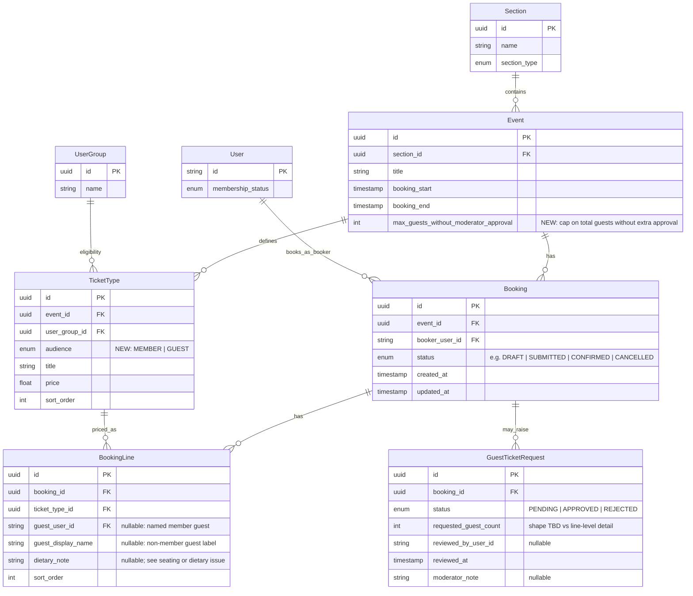

# Booking data model (proposed)

This document captures the **proposed** persistence for member ticket booking. It aligns with [GitHub issue #45](https://github.com/rafsodc/sodc-web/issues/45) and epic [#52](https://github.com/rafsodc/sodc-web/issues/52). Implementation may evolve; update this doc when the schema lands.

## Decisions (from issue discussion)

- **Guest cap before moderator approval**: stored **per event** on `Event` (e.g. total guest headcount allowed without extra approval — exact field name TBD in schema).
- **Ticket types**: each `TicketType` has an **audience** of **`MEMBER`** or **`GUEST`** (not “self/guest” naming). Validation in the booking rules layer must prevent booking a `GUEST` type against the member line and vice versa; pricing can differ per type.
- **Authorization** (section `ACCESS` / `MODERATOR`, `BOOKER`, booking window, `TicketType.userGroup`) remains as documented elsewhere — not all shown on this ERD.

## Entity relationship diagram

## Relationship notes

| Relationship | Meaning |
|--------------|--------|
| **Event → TicketType** | Event offers priced **MEMBER** and **GUEST** types; eligibility for each type is still via `TicketType.userGroup`. |
| **Event → new field** | Per-event limit on **total guest** headcount before additional moderator approval (semantics enforced in booking rules). |
| **Booking** | One **booker** (`User`) for one **event**. |
| **BookingLine** | Each row is a ticket line referencing a **`TicketType`**; the type’s **`audience`** must match use (**MEMBER** for the booker, **GUEST** for guests). Optional guest identity fields. |
| **GuestTicketRequest** | Rows for **extra** guests that need **moderator approval** beyond the standard flow; ties to [#48](https://github.com/rafsodc/sodc-web/issues/48). |

## Related issues

| Issue | Topic |
|-------|--------|
| [#45](https://github.com/rafsodc/sodc-web/issues/45) | Data model: bookings, attendees, guest requests |
| [#46](https://github.com/rafsodc/sodc-web/issues/46) | Booking rules engine |
| [#48](https://github.com/rafsodc/sodc-web/issues/48) | Moderator approval for extra guests |
| [#49](https://github.com/rafsodc/sodc-web/issues/49) | Dietary, seating, accommodation |
| [#52](https://github.com/rafsodc/sodc-web/issues/52) | Parent epic |

## Schema source of truth

When implemented, the canonical definitions live in [`dataconnect/schema/schema.gql`](../../dataconnect/schema/schema.gql). Update this document after enums and table names are finalized.
