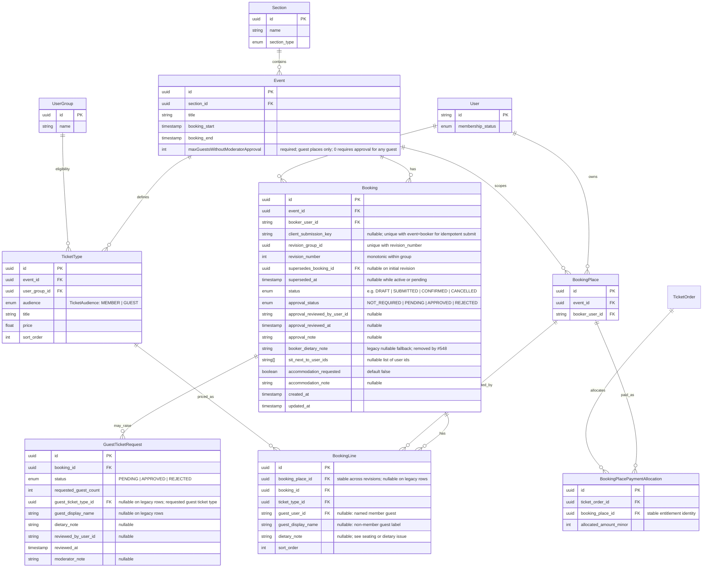

# Booking data model

Persistence for member ticket booking. The current redesign is tracked by epic [#538](https://github.com/rafsodc/sodc-web/issues/538), schema issue [#543](https://github.com/rafsodc/sodc-web/issues/543), and atomic submission issue [#544](https://github.com/rafsodc/sodc-web/issues/544). The canonical schema is in [`dataconnect/schema/schema.gql`](../../dataconnect/schema/schema.gql); update this doc when behavior or naming changes.

## Decisions (from issue discussion)

- **Guest cap before moderator approval**: stored **per event** as required `maxGuestsWithoutModeratorApproval: Int!`. It counts guest places only, excluding the member. `0` means every booking containing a guest requires approval; null is not a valid event policy.
- **Legacy null policy**: the #543 migration backfills any existing null limit to `0` before applying `NOT NULL`, which fails closed by requiring approval for every guest booking until an organiser chooses another value.
- **Ticket types**: each `TicketType` has **`audience: TicketAudience`** (**`MEMBER`** | **`GUEST`**). Validation in the booking rules layer must prevent booking a `GUEST` type against the member line and vice versa; pricing can differ per type.
- **Uniform guest representation**: every guest is a `BookingLine` whose ticket type has `GUEST` audience. There is no separate representation for the first guest in the redesigned contract.
- **Dietary requirements**: every attendee's dietary note belongs to their `BookingLine`, including the member ticket. `Booking.bookerDietaryNote` is a temporary legacy read fallback only and is removed by #548.
- **Whole-booking approval**: `Booking.approvalStatus` applies to one exact booking revision and is separate from booking lifecycle and payment state.
- **Reapproval**: adding/removing a guest, changing guest identity/name, or changing guest ticket type is approval-relevant. Dietary-only edits and guest ordering are not.
- **Guest removal and payment**: a member may remove a guest only when that guest place has no paid allocation. Paid guest removal is blocked until the later refund workflow is implemented.
- **Stable paid entitlement**: `BookingPlace` is the durable identity of one member/guest ticket. Revision-specific `BookingLine` rows reuse that relation, and `BookingPlacePaymentAllocation` maps orders directly to the place without duplicating its key or pointing at one revision.
- **Authorization** (section `ACCESS` / `MODERATOR`, `BOOKER`, booking window, `TicketType.userGroup`) remains as documented elsewhere — not all shown on this ERD.

## Entity relationship diagram

```mermaid
erDiagram
  Section ||--o{ Event : contains
  Event ||--o{ TicketType : defines
  Event ||--o{ Booking : has
  User ||--o{ Booking : books_as_booker
  User ||--o{ BookingPlace : owns
  Event ||--o{ BookingPlace : scopes
  Booking ||--o{ BookingLine : has
  BookingPlace ||--o{ BookingLine : represented_by
  BookingPlace ||--o{ BookingPlacePaymentAllocation : paid_as
  TicketOrder ||--o{ BookingPlacePaymentAllocation : allocates
  TicketType ||--o{ BookingLine : priced_as
  UserGroup ||--o{ TicketType : eligibility
  Booking ||--o{ GuestTicketRequest : may_raise

  Section {
    uuid id PK
    string name
    enum section_type
  }

  Event {
    uuid id PK
    uuid section_id FK
    string title
    timestamp booking_start
    timestamp booking_end
    int maxGuestsWithoutModeratorApproval "required; guest places only; 0 requires approval for any guest"
  }

  TicketType {
    uuid id PK
    uuid event_id FK
    uuid user_group_id FK
    enum audience "TicketAudience: MEMBER | GUEST"
    string title
    float price
    int sort_order
  }

  User {
    string id PK
    enum membership_status
  }

  UserGroup {
    uuid id PK
    string name
  }

  Booking {
    uuid id PK
    uuid event_id FK
    string booker_user_id FK
    string client_submission_key "nullable; unique with event+booker for idempotent submit"
    uuid revision_group_id "unique with revision_number"
    int revision_number "monotonic within group"
    uuid supersedes_booking_id FK "nullable on initial revision"
    timestamp superseded_at "nullable while active or pending"
    enum status "e.g. DRAFT | SUBMITTED | CONFIRMED | CANCELLED"
    enum approval_status "NOT_REQUIRED | PENDING | APPROVED | REJECTED"
    string approval_reviewed_by_user_id "nullable"
    timestamp approval_reviewed_at "nullable"
    string approval_note "nullable"
    string booker_dietary_note "legacy nullable fallback; removed by #548"
    string[] sit_next_to_user_ids "nullable list of user ids"
    boolean accommodation_requested "default false"
    string accommodation_note "nullable"
    timestamp created_at
    timestamp updated_at
  }

  BookingPlace {
    uuid id PK
    uuid event_id FK
    string booker_user_id FK
  }

  BookingLine {
    uuid id PK
    uuid booking_place_id FK "stable across revisions; nullable on legacy rows"
    uuid booking_id FK
    uuid ticket_type_id FK
    string guest_user_id FK "nullable: named member guest"
    string guest_display_name "nullable: non-member guest label"
    string dietary_note "nullable; see seating or dietary issue"
    int sort_order
  }

  GuestTicketRequest {
    uuid id PK
    uuid booking_id FK
    enum status "PENDING | APPROVED | REJECTED"
    int requested_guest_count
    uuid guest_ticket_type_id FK "nullable on legacy rows; requested guest ticket type"
    string guest_display_name "nullable on legacy rows"
    string dietary_note "nullable"
    string reviewed_by_user_id "nullable"
    timestamp reviewed_at
    string moderator_note "nullable"
  }

  BookingPlacePaymentAllocation {
    uuid id PK
    uuid ticket_order_id FK
    uuid booking_place_id FK "stable entitlement identity"
    int allocated_amount_minor
  }
```

`GuestTicketRequest` is shown only because legacy code still reads it during the staged redesign. New submissions must not create it; issue #548 removes the table and remaining consumers after the unified flow is integrated.

## Relationship notes

| Relationship | Meaning |
|--------------|--------|
| **Event → TicketType** | Event offers priced **MEMBER** and **GUEST** types; eligibility for each type is still via `TicketType.userGroup`. |
| **Event → guest policy** | Required per-event limit on guest places that can proceed without moderator approval. |
| **Booking** | One **booker** (`User`) for one **event/revision**; owns lifecycle and whole-revision approval state plus booker preferences. |
| **BookingPlace** | Durable identity for one member/guest ticket within an event. It survives revisions and is the target for payment allocation and future refunds. |
| **BookingLine** | Revision snapshot of one priced place, including that attendee's dietary note. New lines reference `BookingPlace`; the relation is temporarily nullable only for legacy rows/write paths removed by #548. |
| **BookingPlacePaymentAllocation** | Attributes an order amount directly to `BookingPlace`, so revisions never rewrite payment history and deletion/refunds are evaluated per ticket rather than by ticket-type totals. |
| **GuestTicketRequest** | Legacy split representation only. New submission and moderation contracts use `BookingLine` and `Booking.approvalStatus`; removal is tracked by #548. |

## State model

Lifecycle, approval, and payment remain independent persisted concerns:

| Concern | States / source |
|---|---|
| Booking lifecycle | `DRAFT`, `SUBMITTED`, `CONFIRMED`, `CANCELLED` |
| Whole-revision approval | `NOT_REQUIRED`, `PENDING`, `APPROVED`, `REJECTED` |
| Payment | Derived from `TicketOrder` and `BookingPaymentAdjustment` records |

The member-facing state is derived in this priority order:

| Condition | Member-facing state |
|---|---|
| lifecycle is `CANCELLED` | Cancelled |
| lifecycle is `DRAFT` | Draft |
| approval is `PENDING` | Pending approval |
| approval is `REJECTED` | Changes required |
| lifecycle is `CONFIRMED` | Confirmed |
| an eligible payment/order is processing | Payment processing |
| approval is `NOT_REQUIRED` or `APPROVED` and payment remains | Payment required |

Free bookings skip Stripe and move to `CONFIRMED` once approval is `NOT_REQUIRED` or `APPROVED` (implemented by #545).

## Revision approval rules

- Initial submission derives approval from the number of guest-audience booking lines.
- Guest count at or below the configured limit produces `NOT_REQUIRED`; above it produces `PENDING`.
- For an over-limit revision, a changed guest count, identity/name, or ticket type produces `PENDING`.
- An over-limit dietary-only or ordering change carries forward the prior approval state.
- Moving a revision to at or below the limit produces `NOT_REQUIRED`.
- Review audit fields belong to the exact revision reviewed. A later approval-relevant edit cannot reuse that decision.
- Removing an unpaid guest is allowed and follows the normal approval-reset rules. Removing a guest with a paid allocation is rejected until the refund workflow exists.

## Atomic submission contract

`submitEventBooking` accepts the member line, every guest line, preferences, and the revision base in one request. It validates access, the booking window, ticket eligibility, guest identity fields, the guest threshold, and revision concurrency before writing.

Persistence uses a named Data Connect operation with `@transaction` to insert the `Booking`, any new stable `BookingPlace` rows, and every revision-specific `BookingLine` together. An activating revision also retires prior unsuperseded rows and records its `BookingPaymentAdjustment` in that transaction. A pending revision does not retire the last approved/payable revision.

The operations live in the server-only `booking-service` connector. Firebase currently supports typed `_Data` batch variables in Data Connect operations but does not generate JavaScript SDK wrappers for them, so Functions invokes the deployed, schema-validated named mutation with an explicit TypeScript variable contract. This is deliberately distinct from the Admin SDK generic `insertMany` API: enum-bearing booking and legacy guest-request values are interpreted through declared GraphQL input types, avoiding the quoted-enum production failure tracked in #538/#544.

Each booking revision is unique on `(revisionGroupId, revisionNumber)`. Together with the idempotency uniqueness on `(event, booker, clientSubmissionKey)`, this makes concurrent stale submissions fail rather than create parallel revisions. A duplicate retry refetches and returns the already-committed outcome.

The callable outcome is intentionally small:

- `PENDING_APPROVAL` when the whole revision is above the guest threshold and needs review;
- `READY_FOR_PAYMENT` when approval is not required or has been carried forward.

Changing an attendee identity or ticket replaces the stable place. If the replaced/removed place has a `PAID` allocation, submission fails with `PAID_BOOKING_PLACE_REMOVAL_REQUIRES_REFUND`; dietary-only changes reuse the place.

## Related issues

| Issue | Topic |
|-------|--------|
| [#45](https://github.com/rafsodc/sodc-web/issues/45) | Data model: bookings, attendees, guest requests |
| [#46](https://github.com/rafsodc/sodc-web/issues/46) | Booking rules engine |
| [#48](https://github.com/rafsodc/sodc-web/issues/48) | Moderator approval for extra guests |
| [#49](https://github.com/rafsodc/sodc-web/issues/49) | Dietary, seating, accommodation |
| [#52](https://github.com/rafsodc/sodc-web/issues/52) | Parent epic |
| [#544](https://github.com/rafsodc/sodc-web/issues/544) | Atomic complete-booking submission and amendments |

## Schema source of truth

Canonical definitions: [`dataconnect/schema/schema.gql`](../../dataconnect/schema/schema.gql). Operations: [`dataconnect/api/queries.gql`](../../dataconnect/api/queries.gql), [`dataconnect/api/booking-mutations.gql`](../../dataconnect/api/booking-mutations.gql), atomic server writes in [`dataconnect/booking-service/booking-submission.gql`](../../dataconnect/booking-service/booking-submission.gql), and event/ticket admin mutations in [`dataconnect/api/user-group-mutations.gql`](../../dataconnect/api/user-group-mutations.gql).

Server-side submission (rules + persistence): see [`booking-submission-api.md`](./booking-submission-api.md) (`submitEventBooking` callable, issue **#46**).
