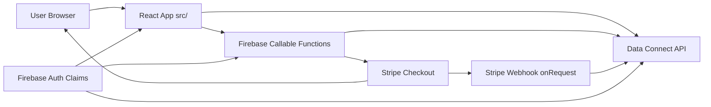

# System Overview

This document maps the primary runtime flow across frontend, Firebase Functions, Data Connect, and Stripe.

## High-level architecture

## Main request paths

1. **Member reads data**
   - Frontend queries Data Connect operations with user/auth claim restrictions.
2. **Booking submit**
   - Frontend calls `submitEventBooking` callable.
   - Function validates rules and writes through admin SDK operations.
3. **Checkout**
   - Frontend calls `createTicketCheckoutSession`.
   - Function creates order + Stripe session, then browser redirects to Stripe.
4. **Payment fulfillment**
   - Stripe sends webhook to `stripeWebhook`.
   - Function verifies signature and updates order state.

## Security boundaries

- Data Connect operations enforce `@auth(...)` per operation.
- Functions enforce entry guards (`requireAuth`, `requireEnabled`, `requireAdmin`).
- Stripe webhook uses signature verification before state transitions.
