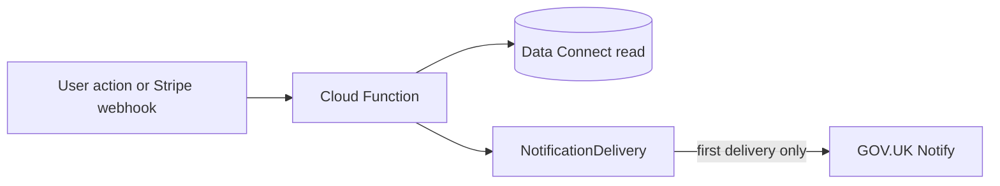

# Transactional email workflows

App-owned transactional email uses **GOV.UK Notify** via [`functions/src/mailer.ts`](../../functions/src/mailer.ts) and idempotent delivery via [`functions/src/notificationDelivery.ts`](../../functions/src/notificationDelivery.ts). Firebase Auth still sends verification emails.

Per-template placeholder specs live in the linked `govuk-notify-*.md` files below. **Draft Notify subject/body copy:** [govuk-notify-template-copy.md](./govuk-notify-template-copy.md). **Registration runbook:** [govuk-notify-template-registration.md](./govuk-notify-template-registration.md). Environment variables: [environment-and-secrets.md](./environment-and-secrets.md).

## Shared delivery pattern

1. A callable or Stripe webhook completes a domain write.
2. Code calls `sendNotificationOnce` with a stable **`deliveryKey`** (or a dispatcher that does).
3. On first send, Notify is called and a `NotificationDelivery` row is recorded; retries/replays return without a second email.

## Domain workflows

### Ticket order lifecycle (customer)

| | |
|---|---|
| **Trigger** | Stripe webhook applies `PAID`, `FAILED`, or `REFUNDED` to a `TicketOrder` |
| **Entrypoint** | [`functions/src/payments.ts`](../../functions/src/payments.ts) → [`emitPaymentLifecycleNotification`](../../functions/src/paymentNotifications.ts) → [`paymentLifecycleEmailDispatcher.ts`](../../functions/src/paymentLifecycleEmailDispatcher.ts) |
| **Recipient** | Purchaser email from order query |
| **No send** | Transition not applied (`noop_replay`, illegal transition); dispute side-state path |
| **Delivery key** | `payment:{orderId}:{type}:{stripeEventId}` |
| **Templates** | `ticketOrderPaid`, `ticketOrderFailed`, `ticketOrderRefunded` |
| **Deep dive** | [govuk-notify-ticket-order-templates.md](./govuk-notify-ticket-order-templates.md) |

### Payment ops (internal)

| | |
|---|---|
| **Trigger** | Reconciliation exception newly opened or reopened; Stripe dispute side-state webhook |
| **Entrypoint** | [`payments.ts`](../../functions/src/payments.ts) → [`paymentOpsInternalAlerts.ts`](../../functions/src/paymentOpsInternalAlerts.ts) |
| **Recipient** | `PAYMENT_OPS_ALERT_EMAILS` (comma-separated); unset = no sends |
| **No send** | `ACTIVE_DISPUTE` opened from dispute webhook (dispute alert covers it); ops list empty |
| **Templates** | `paymentReconciliationExceptionAlert`, `paymentDisputeOpsAlert` |
| **Deep dive** | [govuk-notify-payment-ops-internal-templates.md](./govuk-notify-payment-ops-internal-templates.md) |

### Membership access (user)

| | |
|---|---|
| **Trigger** | Successful `updateMembershipStatus` when status value changes |
| **Entrypoint** | [`membershipStatus.ts`](../../functions/src/membershipStatus.ts) → [`membershipStatusEmailDispatcher.ts`](../../functions/src/membershipStatusEmailDispatcher.ts) |
| **Recipient** | User profile email |
| **No send** | Same status before/after; transitions that do not map to activated/restricted templates |
| **Templates** | `membershipActivated`, `membershipAccessRestricted` |
| **Deep dive** | [govuk-notify-membership-templates.md](./govuk-notify-membership-templates.md) |

### Guest ticket requests (moderators + booker)

| | |
|---|---|
| **Trigger** | `submitGuestTicketRequest` (moderators); `reviewGuestTicketRequest` approve/reject (booker) |
| **Entrypoint** | [`guestTicketRequests.ts`](../../functions/src/guestTicketRequests.ts) → [`guestTicketRequestEmails.ts`](../../functions/src/guestTicketRequestEmails.ts) |
| **Recipient** | Deduped moderator/admin emails on submit; booker on review |
| **No send** | Failed DC insert/review; missing booker email |
| **Delivery keys** | Per moderator: `guest-request-mod:{requestId}:{email}`; booker: `guest-request-booker:{requestId}:{decision}` |
| **Templates** | `guestTicketRequestSubmittedModerator`, `guestTicketRequestApproved`, `guestTicketRequestRejected` |
| **Deep dive** | [govuk-notify-guest-ticket-request-templates.md](./govuk-notify-guest-ticket-request-templates.md) |

### Bookings (booker)

| | |
|---|---|
| **Trigger** | Successful `submitEventBooking` after status set to `SUBMITTED` |
| **Entrypoint** | [`bookings.ts`](../../functions/src/bookings.ts) → [`bookingEmailDispatcher.ts`](../../functions/src/bookingEmailDispatcher.ts) |
| **Recipient** | Booker email |
| **No send** | Response has **`idempotentReplay: true`** (terminal booking already exists for key) |
| **Templates** | `bookingConfirmation` (new booking); `bookingRevision` (supersedes prior booking) |
| **Deep dive** | [govuk-notify-booking-templates.md](./govuk-notify-booking-templates.md) |

## Manual QA (Beta)

After templates are provisioned per Firebase environment (see [govuk-notify-template-registration.md](./govuk-notify-template-registration.md)):

- [ ] Ticket checkout → paid email; failed/refund paths in test mode
- [ ] Reconciliation exception opens → internal alert
- [ ] Dispute webhook → internal dispute alert (no customer lifecycle email)
- [ ] Admin activates member / restricts member → correct user email
- [ ] Guest ticket submit → moderator inboxes; approve/reject → booker
- [ ] New booking → confirmation; revision → revision email; same idempotency key replay → no second email

## Related issues

- Epic: [#183](https://github.com/rafsodc/sodc-web/issues/183)
- Implementation: [#186](https://github.com/rafsodc/sodc-web/issues/186)–[#190](https://github.com/rafsodc/sodc-web/issues/190)
- Housekeeping: [#216](https://github.com/rafsodc/sodc-web/issues/216)
- Email policy (operational vs optional): [transactional-email-policy.md](./transactional-email-policy.md) ([#191](https://github.com/rafsodc/sodc-web/issues/191))
