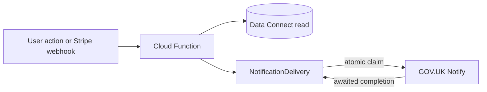

# Transactional email workflows

App-owned transactional email uses **GOV.UK Notify** via [`functions/src/mailer.ts`](../../functions/src/mailer.ts) and idempotent delivery via [`functions/src/notificationDelivery.ts`](../../functions/src/notificationDelivery.ts). Firebase Auth still sends verification emails.

Per-template placeholder specs live in the linked `govuk-notify-*.md` files below. **Draft Notify subject/body copy:** [govuk-notify-template-copy.md](./govuk-notify-template-copy.md). **Registration runbook:** [govuk-notify-template-registration.md](./govuk-notify-template-registration.md). Environment variables: [environment-and-secrets.md](./environment-and-secrets.md).

## Shared delivery pattern

1. A callable or Stripe webhook completes a domain write.
2. The handler awaits a dispatcher that calls `sendNotificationOnce` with a stable **`deliveryKey`**.
3. `sendNotificationOnce` atomically claims a `PENDING` ledger attempt before calling Notify.
4. The same invocation awaits Notify and conditionally records `SENT` or `FAILED` before returning.
5. Retries return immediately for `SENT` deliveries and can reclaim `FAILED` or stale `PENDING` deliveries without two invocations owning the same attempt.

## Retry and stale-claim recovery

`PENDING` is a time-bounded processing lease, not a permanent skip state. A claim is considered active for **10 minutes** from `lastAttemptedAt`. During that window, another invocation returns `duplicate / in_progress`. After the lease expires, the next invocation with the same channel and delivery key may take over the row, increment `attemptCount`, and retry the send.

Takeover uses a conditional Data Connect update matching the row's status and previous attempt count. Only one concurrent invocation can win. `SENT` and `FAILED` completion updates also match the owning attempt count, so an expired invocation cannot overwrite a newer attempt if it resumes late. A direct domain retry can reclaim `FAILED` immediately; scheduled recovery applies a cooldown to avoid hammering the provider.

Before sending an email with a stable Notify reference, the mailer queries GOV.UK Notify for an existing notification with that reference. If Notify accepted the earlier attempt but the function terminated before recording `SENT`, recovery adopts the existing provider notification ID and completes the ledger instead of sending a duplicate email.

Every new delivery stores a versioned `recoveryPayload` containing the minimum routing
context needed to reconstruct its dispatcher. Fan-out workflows also store the original
recipient address so recovery cannot silently target a newly resolved audience. These
ledger operations are server-only (`NO_ACCESS`), and recovery logs never include the
payload, delivery key, or recipient. Before recovery, the worker derives the expected
notification type and delivery key from that payload and requires both to match the
ledger row.

The `recoverNotificationDeliveries` scheduled function runs every **5 minutes**:

- `FAILED` rows are eligible after a **15-minute cooldown**.
- `PENDING` rows are eligible after their **10-minute lease** expires.
- At most **25 rows** are processed per invocation.
- A delivery stops being selected after **6 attempts** and requires investigation.
- `SENT`, fresh `PENDING`, malformed, mismatched, or payload-free legacy rows are never sent.

Malformed, mismatched, and dispatcher no-op attempts are recorded with a compare-and-set
failure update. This advances the same bounded attempt count without overwriting a row
that another invocation has claimed or completed.

The worker re-enters the normal domain dispatcher. `sendNotificationOnce` then claims
the original row and increments `attemptCount`; concurrent workers or manual retries
still cannot both own the attempt.

### Monitoring and manual operation

1. Monitor the `notification recovery job completed` structured log. Alert on a
   non-zero `failed` or `invalid` count, or on repeated scheduler failure. Periodically
   inspect `NotificationDelivery` for `FAILED` rows at the 6-attempt limit, because
   exhausted rows are intentionally excluded from scheduler batches.
2. Use `deliveryId`, `notificationType`, `status`, and `attemptCount` from logs to inspect
   the corresponding `NotificationDelivery` row. Recovery logs deliberately omit raw
   delivery keys and recipient addresses.
3. For `SENT`, take no action. For fresh `PENDING`, wait for lease expiry.
4. For an exhausted or invalid row, verify the domain state and recovery payload before
   replaying the domain dispatcher. Always preserve the original delivery key.
5. To run recovery immediately, use **Run now** for
   `recoverNotificationDeliveries` in Google Cloud Scheduler. The same eligibility,
   cooldown, lease, batch, and attempt-limit checks still apply.

Rows created before `recoveryPayload` was deployed are not automatically selected.
Recover those legacy rows through a reviewed domain-specific replay; a new-code retry
backfills the recovery payload when it reclaims the existing row.

Deploy the Data Connect schema and generated connector operations before deploying the
scheduled Function. Confirm `GOV_NOTIFY_API_KEY` is available to the Function in each
environment.

Check Functions logs for `notification delivery failed`, `notification recovery attempt failed`, `notification delivery sent after its lease was replaced`, or `notification delivery failure occurred after its lease was replaced`. Because every server entry path awaits its dispatcher, ordinary provider errors are normally recorded as `FAILED` within the originating invocation; stale recovery is primarily for process termination after a claim.

## GOV.UK Notify delivery receipts

`notifyDeliveryCallback` authenticates delivery receipts with `NOTIFY_CALLBACK_BEARER_TOKEN` and records every valid provider receipt ID in `NotifyDeliveryReceipt`. The provider ID is the table key, so an exact replay cannot create a second ledger entry. A receipt is processed under a 10-minute `PENDING` lease; failed or stale attempts can be reclaimed, while a concurrent callback for a fresh claim receives a retryable response.

When the permanent-failure threshold changes a user's status to `LOST`, receipt
processing also reconciles Firebase Auth to `enabled: false`. The receipt is not marked
processed until that claim reconciliation succeeds. A failed claim write therefore
leaves the receipt eligible for replay, including when the Data Connect status update
already succeeded. See [Enabled-claim reconciliation](enabled-claim-reconciliation.md).

Delivery ordering uses Notify's first valid timestamp in this order: `completed_at`, `sent_at`, then `created_at`. The function receive time is used only when Notify supplies none of those timestamps. The timestamp and receipt ID form a deterministic ordering key, so callbacks with equal timestamps still have a stable order.

User bounce state is derived from the newest final receipts rather than incremented with an unprotected read/write pair:

- `delivered` resets the consecutive bounce count when it is the newest final state.
- `permanent-failure` contributes to the consecutive count, capped at the `LOST` threshold of three.
- older receipts are retained for audit and can change the derived consecutive count, but cannot replace a newer delivery status.
- user and announcement-recipient updates use versioned compare-and-swap mutations, so concurrent callbacks retry against the newest ledger state.
- membership changes to `LOST` happen in the same user-row mutation as the threshold-reaching bounce state.

Announcement receipts use the same ordering rules, keyed by the stable announcement reference. An older `delivered` callback therefore cannot overwrite a newer `bounced` result (or vice versa).

Operational recovery:

1. Correlate the callback using `receiptId` in Functions logs. Recipient email addresses and raw references are not logged; `recipientHash` and `referenceHash` are SHA-256 correlation values.
2. Inspect the matching `NotifyDeliveryReceipt` row's `processingStatus`, `attemptCount`, `lastAttemptedAt`, `outcome`, and `lastErrorMessage`.
3. Do not delete or recreate a processed receipt. Replaying the original callback body is safe and returns without applying state again.
4. A `FAILED` receipt can be replayed immediately. A `PENDING` receipt can be replayed after its 10-minute lease; the compare-and-swap claim ensures only one recovery attempt wins.
5. A fresh concurrent `PENDING` response is intentionally retryable. Allow the owning invocation to finish before investigating it as stuck.

## Domain workflows

### Ticket order lifecycle (customer)

| | |
|---|---|
| **Trigger** | Stripe webhook applies `PAID`, `FAILED`, or `REFUNDED` to a `TicketOrder` |
| **Entrypoint** | [`paymentWebhook.ts`](../../functions/src/paymentWebhook.ts) → [`paymentReconciliationService.ts`](../../functions/src/paymentReconciliationService.ts) → [`emitPaymentLifecycleNotification`](../../functions/src/paymentNotifications.ts) → [`paymentLifecycleEmailDispatcher.ts`](../../functions/src/paymentLifecycleEmailDispatcher.ts) |
| **Recipient** | Purchaser email from order query |
| **No send** | Transition not applied (`noop_replay`, illegal transition); dispute side-state path |
| **Delivery key** | `payment:{orderId}:{type}:{stripeEventId}` |
| **Templates** | `ticketOrderPaid`, `ticketOrderFailed`, `ticketOrderRefunded` |
| **Deep dive** | [govuk-notify-ticket-order-templates.md](./govuk-notify-ticket-order-templates.md) |

### Payment ops (internal)

| | |
|---|---|
| **Trigger** | Reconciliation exception newly opened or reopened; Stripe dispute side-state webhook |
| **Entrypoint** | [`paymentWebhook.ts`](../../functions/src/paymentWebhook.ts) / [`paymentReconciliationService.ts`](../../functions/src/paymentReconciliationService.ts) → [`paymentOpsInternalAlerts.ts`](../../functions/src/paymentOpsInternalAlerts.ts) |
| **Recipient** | `PAYMENT_OPS_ALERT_EMAILS` (comma-separated); unset = no sends |
| **No send** | `ACTIVE_DISPUTE` opened from dispute webhook (dispute alert covers it); ops list empty |
| **Templates** | `paymentReconciliationExceptionAlert`, `paymentDisputeOpsAlert` |
| **Deep dive** | [govuk-notify-payment-ops-internal-templates.md](./govuk-notify-payment-ops-internal-templates.md) |

### Membership access (user)

| | |
|---|---|
| **Trigger** | Successful `updateMembershipStatus` when status value changes |
| **Entrypoint** | [`membershipStatus.ts`](../../functions/src/membershipStatus.ts) → [`membershipStatusEmailDispatcher.ts`](../../functions/src/membershipStatusEmailDispatcher.ts) |
| **Recipient** | User profile email |
| **No send** | Same status before/after; transitions that do not map to activated/restricted templates |
| **Templates** | `membershipActivated`, `membershipAccessRestricted` |
| **Deep dive** | [govuk-notify-membership-templates.md](./govuk-notify-membership-templates.md) |

### Guest ticket requests (moderators + booker)

| | |
|---|---|
| **Trigger** | `submitGuestTicketRequest` (moderators); `reviewGuestTicketRequest` approve/reject (booker) |
| **Entrypoint** | [`guestTicketRequests.ts`](../../functions/src/guestTicketRequests.ts) → [`guestTicketRequestEmails.ts`](../../functions/src/guestTicketRequestEmails.ts) |
| **Recipient** | Deduped moderator/admin emails on submit; booker on review |
| **No send** | Failed DC insert/review; missing booker email |
| **Delivery keys** | Per moderator: `guest-request-mod:{requestId}:{email}`; booker: `guest-request-booker:{requestId}:{decision}` |
| **Templates** | `guestTicketRequestSubmittedModerator`, `guestTicketRequestApproved`, `guestTicketRequestRejected` |
| **Deep dive** | [govuk-notify-guest-ticket-request-templates.md](./govuk-notify-guest-ticket-request-templates.md) |

### Bookings (booker)

| | |
|---|---|
| **Trigger** | Successful `submitEventBooking` after status set to `SUBMITTED` |
| **Entrypoint** | [`bookings.ts`](../../functions/src/bookings.ts) → [`bookingEmailDispatcher.ts`](../../functions/src/bookingEmailDispatcher.ts) |
| **Recipient** | Booker email |
| **No send** | Response has **`idempotentReplay: true`** (terminal booking already exists for key) |
| **Templates** | `bookingConfirmation` (new booking); `bookingRevision` (supersedes prior booking) |
| **Deep dive** | [govuk-notify-booking-templates.md](./govuk-notify-booking-templates.md) |

### Approval queue (internal)

| | |
|---|---|
| **Trigger** | `syncPendingUserClaims` (runs at registration and again after profile submit) where the user is newly `isUserPendingApproval` (verified email + `enabled` claim not true + membership status awaiting approval) |
| **Entrypoint** | [`users.ts`](../../functions/src/users.ts) → [`pendingApprovalAdminAlert.ts`](../../functions/src/pendingApprovalAdminAlert.ts) |
| **Recipient** | All current admins (`getAdminUsers()`) |
| **No send** | No Data Connect profile yet; email not verified; membership status not awaiting approval; no admin recipients |
| **Delivery key** | `pending-approval:{userId}:{adminEmail}` |
| **Templates** | `newUserPendingApprovalAlert` |
| **Deep dive** | [govuk-notify-pending-approval-templates.md](./govuk-notify-pending-approval-templates.md) |

## Manual QA (Beta)

After templates are provisioned per Firebase environment (see [govuk-notify-template-registration.md](./govuk-notify-template-registration.md)):

- [ ] Ticket checkout → paid email; failed/refund paths in test mode
- [ ] Reconciliation exception opens → internal alert
- [ ] Dispute webhook → internal dispute alert (no customer lifecycle email)
- [ ] Admin activates member / restricts member → correct user email
- [ ] Guest ticket submit → moderator inboxes; approve/reject → booker
- [ ] New booking → confirmation; revision → revision email; same idempotency key replay → no second email
- [ ] Register, verify email, complete profile → admin alert; repeat profile-submit call → no second email to the same admin

## Related issues

- Epic: [#183](https://github.com/rafsodc/sodc-web/issues/183)
- Implementation: [#186](https://github.com/rafsodc/sodc-web/issues/186)–[#190](https://github.com/rafsodc/sodc-web/issues/190)
- Housekeeping: [#216](https://github.com/rafsodc/sodc-web/issues/216)
- Email policy (operational vs optional): [transactional-email-policy.md](./transactional-email-policy.md) ([#191](https://github.com/rafsodc/sodc-web/issues/191))
